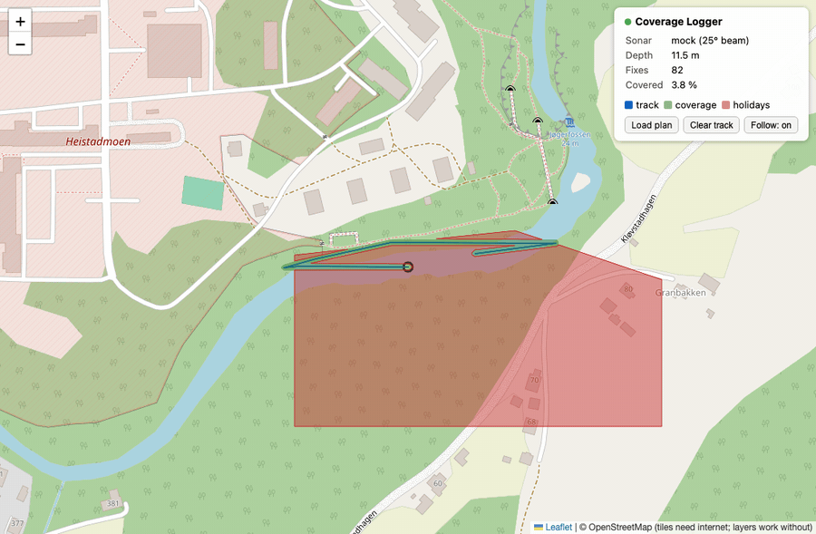

# BlueOS Coverage Logger

A read-only [BlueOS](https://blueos.cloud/) extension for survey QC on the
[BlueBoat](https://bluerobotics.com/store/boat/blueboat/blueboat/): it logs
the vehicle's track from MAVLink2Rest, stamps every fix with sonar depth and
swath width, and serves a live Leaflet map showing the track, the actual
ensonified coverage, and — once you load the survey plan polygon — the
uncovered gaps ("holidays") with a covered-percentage figure.

Read-only by design: the extension never commands the vehicle; it only GETs
telemetry. It cannot misbehave the boat.

Companion to [survey-grid](https://github.com/KevinGriffin-new/survey-grid),
which generates the mission the boat runs; this extension shows whether the
boat actually covered what was planned.



*A simulated BlueBoat (ArduPilot SITL) running a
[survey-grid](https://github.com/KevinGriffin-new/survey-grid) mission at 10×
speed. Green: actual ensonified coverage (mock Ping2, 25° beam, ~10 m depth ⇒
~4.4 m swath). Red: holidays — the 20 m line spacing this mission used leaves
~75 % of the plan uncovered, which is exactly the case for swath-derived
spacing.*

## Install on BlueOS

BlueOS web UI → **Extensions** → **Installed** → **+** (manual install):

- Identifier: `kevingriffin.coverage_logger`
- Name: `coverage-logger`
- Docker image: `dzigavertov/blueos-coverage-logger`, tag `0.1.0`
- Permissions/settings are read from the image labels.

Multi-arch (`linux/arm64` for the BlueBoat's Pi, `linux/amd64` for
desktop/SITL rigs).

## How it works

- **Position**: polls MAVLink2Rest (`GLOBAL_POSITION_INT`) at 2 Hz via
  `host.docker.internal:6040` — correct on real (host-networked) BlueOS and
  on Docker Desktop dev setups alike. Override with `MAV2REST_URL`.
- **Depth / swath**: a pluggable `SonarAdapter` selected by `SONAR_MODEL`:
  - `mock` (default): a slow swell around `MOCK_DEPTH_M` (default 10 m) with
    `MOCK_BEAM_DEG` (default 25°) — zero dependencies, demos anywhere.
  - `ping2`: a **Blue Robotics Ping2** over the real Ping protocol
    (`brping`), UDP at `PING_UDP` — on a boat that's the port BlueOS's ping
    service bridges the device to (e.g. `host.docker.internal:9090`); low-
    confidence readings (below `PING_MIN_CONFIDENCE`, default 50 %) are
    treated as no-data. For development, `app/ping2_sim.py` is a simulated
    Ping2 that answers `brping` byte-for-byte like the device (both request
    dialects) and computes depth from a synthetic seabed evaluated at the
    vehicle's live SITL position — so the same adapter code that will talk
    to real hardware is exercised end-to-end, and swath width varies
    spatially like a real survey:

    ```bash
    uv run python -m app.ping2_sim --port 9110   # beside SITL + BlueOS
    SONAR_MODEL=ping2 PING_UDP=127.0.0.1:9110 uv run uvicorn app.main:app
    ```
- **Coverage**: each track segment is buffered to its local swath width
  (`2 · depth · tan(beam/2)`) in a survey-area-centred transverse-Mercator
  frame; the union is the coverage polygon; plan − coverage = holidays.
- **Storage**: SQLite (WAL) under `/data` — the extension's persistent bind.

## API

| Endpoint | Purpose |
|---|---|
| `GET /` | the live map |
| `GET /register_service` | BlueOS service metadata |
| `GET /api/status` | connection, sonar, fix count, last fix |
| `GET /api/track?since_id=` | raw fixes |
| `GET /api/coverage.geojson` | track + coverage + holidays FeatureCollection |
| `POST /api/plan` | load the survey plan polygon (GeoJSON) |
| `DELETE /api/track` | reset between runs |

## Development

```bash
uv sync && uv run pytest                      # 15 tests
MAV2REST_URL=http://localhost:6040 DATA_DIR=./data \
  uv run uvicorn app.main:app --reload        # against a local BlueOS/SITL
```

Build (multi-arch for the BlueBoat's Pi + amd64):

```bash
docker buildx build --platform linux/arm64,linux/amd64 -t <you>/blueos-coverage-logger:latest .
```

## License

MIT
